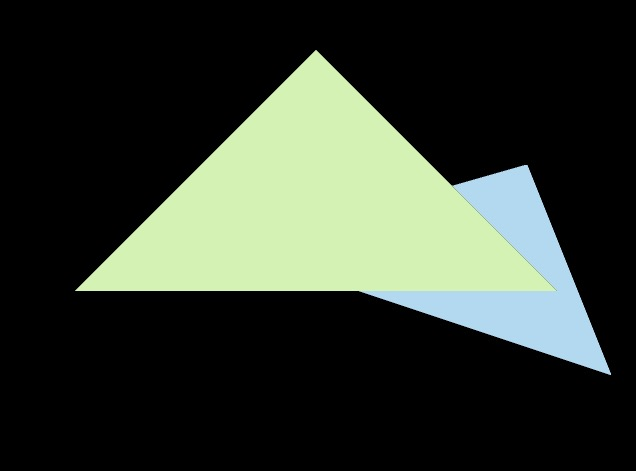
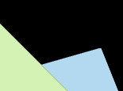

# Assignment2

- [x] [5 分] 正确地提交所有必须的文件，且代码能够编译运行。
- [x] [20 分] 正确实现三角形栅格化算法。
- [x] [10 分] 正确测试点是否在三角形内。
- [x] [10 分] 正确实现 z-buffer 算法, 将三角形按顺序画在屏幕上。
- [x] [提高项 5 分] 用 super-sampling 处理 Anti-aliasing : 你可能会注意 到，当我们放大图像时，图像边缘会有锯齿感。我们可以用 super-sampling 来解决这个问题，即对每个像素进行 2 * 2 采样，并比较前后的结果 (这里 并不需要考虑像素与像素间的样本复用)。需要注意的点有，对于像素内的每 一个样本都需要维护它自己的深度值，即每一个像素都需要维护一个 sample list。最后，如果你实现正确的话，你得到的三角形不应该有不正常的黑边。

实现评分所要求的内容，并且实现了MSAA的的反走样

**实现结果**

**未抗锯齿**

**MSAA**

