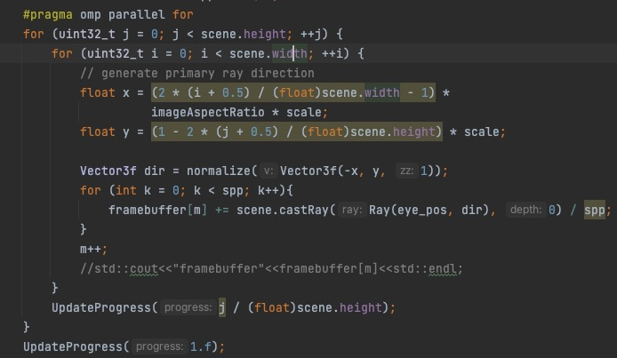
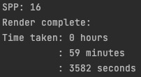
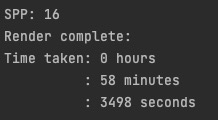
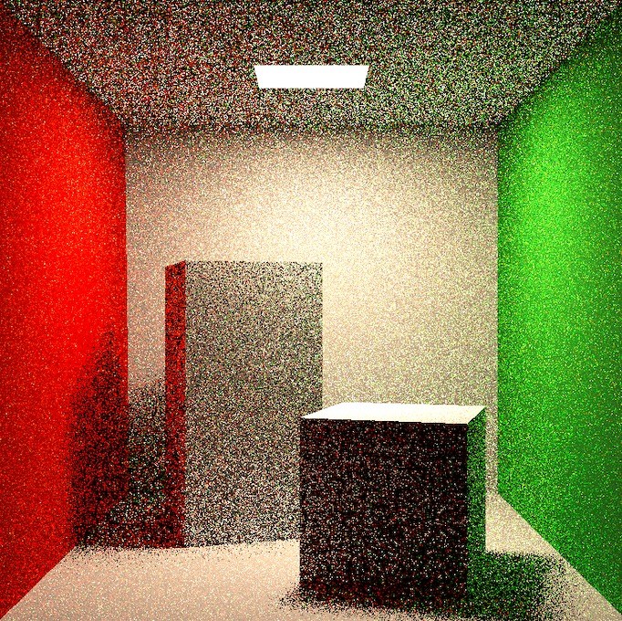
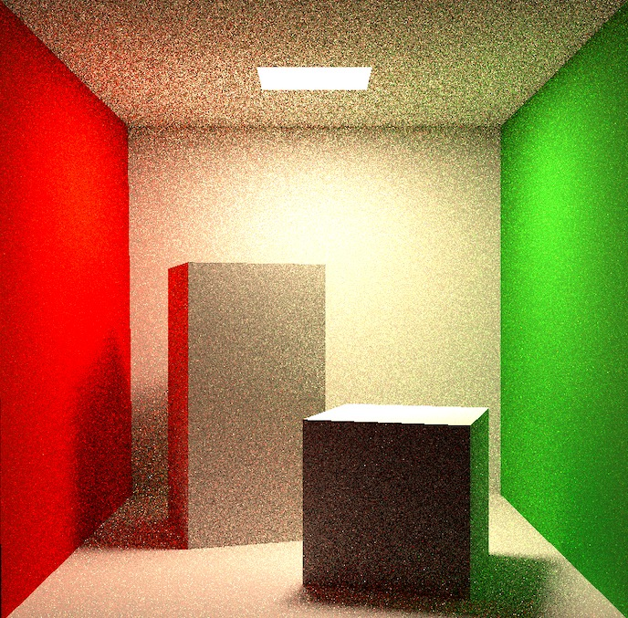

# Assignment 7

- [x] [5 points] 提交格式正确，包含所有需要的文件；代码可以在虚拟机下正确编译运行。

- [x] [45 points] Path Tracing：正确实现 Path Tracing 算法，并提交分辨率 不小于 512*512，采样数不小于 8 的渲染结果图片。

- [x] [加分项 10 points] 多线程：将多线程应用在 Ray Generation 上，注意实现时可能涉及的冲突。

- [ ] [加分项 10 points] Microfacet：正确实现 Microfacet 材质，并提交可 体现 Microfacet 性质的渲染结果。

  使用简单的openmp进行多线程的实现

  

  使用mac air 2017进行作业完成，因为cpu只有两核，所以速度提升不大

  单线程

​		多线程

spp=1:

spp=16:

