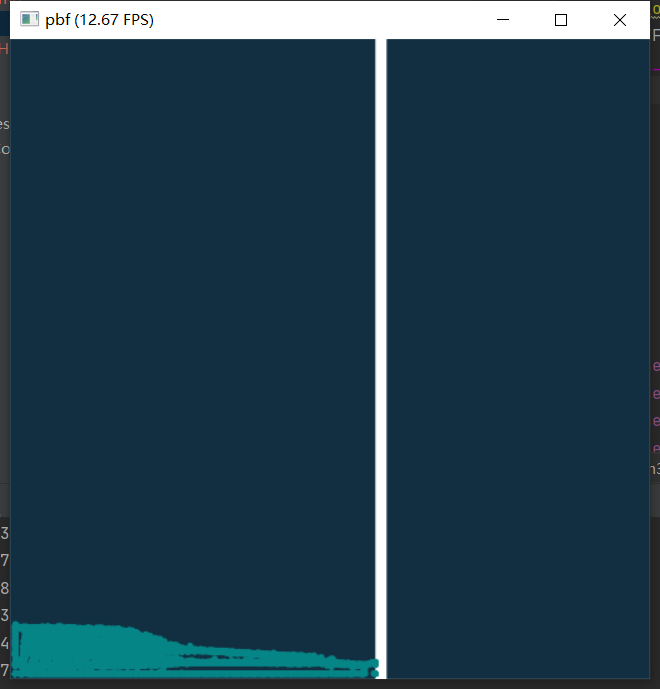

# FinalProject

## 选择题目2.3.2，基于 3D 位置的流体模拟 (难度等级：2.5)

本次作业实现了基于 3D 位置的流体模拟，使用taichi语言进行粒子模拟，然后使用[Fluid-engine-dev](https://github.com/doyubkim/fluid-engine-dev)中的小工具particles2obj进行流体的表面重建，最后使用blender进行渲染

投影到taichi  2d gui上的画面：

blender渲染结果图：

## References

https://github.com/ben441318936/PBF3D_taichi

Position Based Fluids

Position Based Dynamics

Particle-Based Fluid Simulation for Interactive Applications