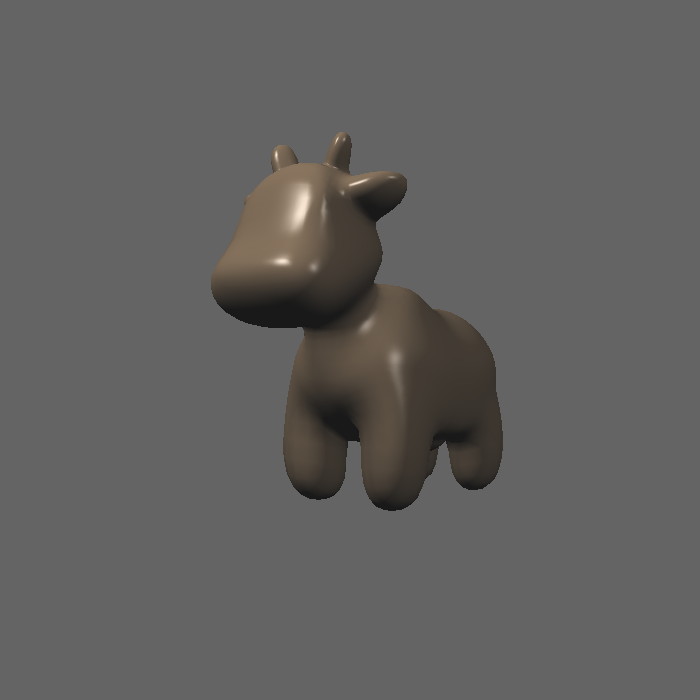
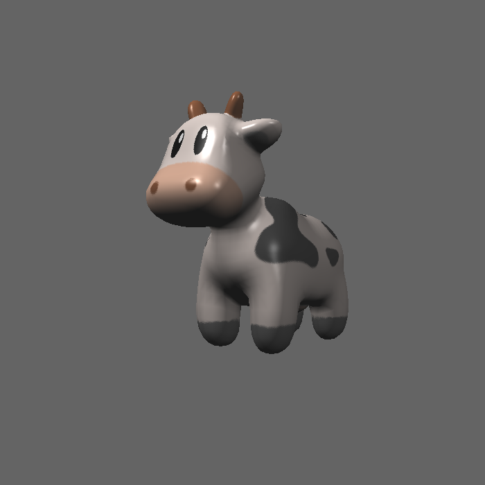
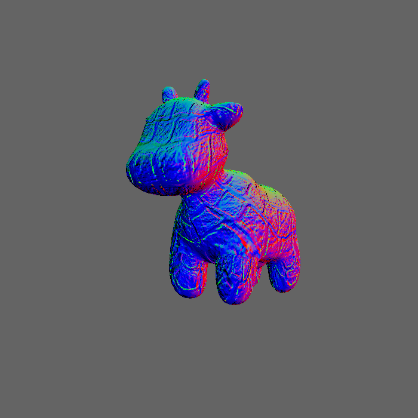
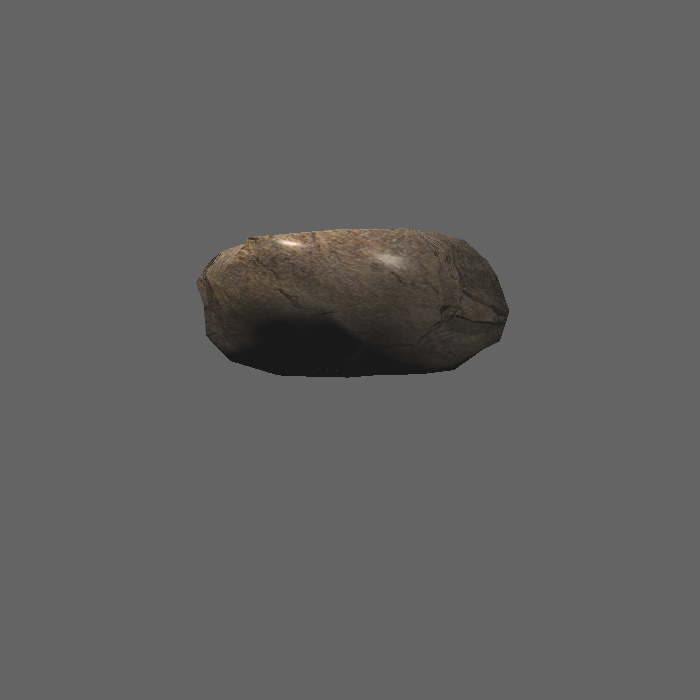

# 作业三

## 得分点

- [x] [5 分] 提交格式正确，包括所有需要的文件。代码可以正常编译、执行。
- [x] [10 分] 参数插值: 正确插值颜色、法向量、纹理坐标、位置 (Shading Position) 并将它们传递给 fragment_shader_payload.
- [x] [20 分]Blinn-phong 反射模型: 正确实现 phong_fragment_shader 对应的 反射模型。
- [x]  [5 分] Texture mapping: 将 phong_fragment_shader 的代码拷贝到 texture_fragment_shader, 在此基础上正确实现 Texture Mapping.
- [x] [10 分] Bump mapping 与 Displacement mapping: 正确实现 Bump mapping 与 Displacement mapping.
- [x] [Bonus 3 分] 尝试更多模型: 找到其他可用的.obj 文件，提交渲染结果并 把模型保存在 /models 目录下。这些模型也应该包含 Vertex Normal 信息。
- [x] [Bonus 5 分] 双线性纹理插值: 使用双线性插值进行纹理采样, 在 Texture 类中实现一个新方法 Vector3f getColorBilinear(float u, float v) 并 通过 fragment shader 调用它。为了使双线性插值的效果更加明显，你应该 考虑选择更小的纹理图。请同时提交纹理插值与双线性纹理插值的结果，并 进行比较。

### Blinn-phong

### Texture mapping

### Bump mapping

### Displacement mapping

### 尝试更多模型

直接选用model下的rock模型

### 双线性纹理插值: 

先将纹理贴图分辨率降低，更容易看出区别

高分辨率未插值：

低分辨率未插值：

低分辨率插值

可以看到在颜色突变的位置有明显优化效果