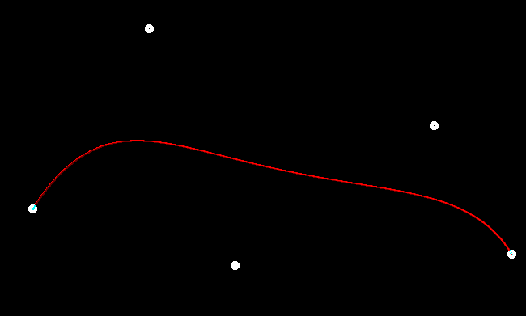

## 得分点

- [x] [5 分] 提交的格式正确，包含所有必须的文件。代码可以编译和运行。
- [x] [20 分] De Casteljau 算法： 对于给定的控制点，你的代码能够产生正确的 Bézier 曲线。
- [x]  [5 分] 奖励分数： 实现对 Bézier 曲线的反走样。(对于一个曲线上的点，不只把它对应于一个像素，你需要根据到像素中心的距离来考虑与它相邻的像素的颜色。)

**反走样效果图**

