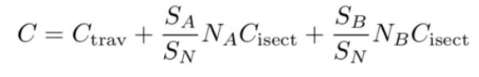

## 完成点

- [x] [5 points] 提交格式正确，包含所有需要的文件；
- [x] [20 points] 包围盒求交：正确实现光线与包围盒求交函数
- [x] [15 points] BVH 查找：正确实现 BVH 加速的光线与场景求交。
- [x] [加分项 20 points] SAH 查找：自学 SAH(Surface Area Heuristic) , 正 确实现 SAH 加速，并且提交结果图片，并在 README.md 中说明 SVH 的实现 方法，并对比 BVH、SVH 的时间开销。(可参考 http://15462.courses.cs .cmu.edu/fall2015/lecture/acceleration/slide_024，也可以查找其他资 料)

## 结果图片 

## SAH实现

简而言之就是将空间先分为n个桶，然后做一条切线将n个桶分成两组，这两组各有一个所含物体的面积，根据面积可以得到下图公式的值



最后求出使Cost（C）最小的分组方式。

### 实现参考

http://15462.courses.cs.cmu.edu/fall2015/lecture/acceleration/slide_038

https://www.cnblogs.com/coolwx/p/14375763.html

https://www.cnblogs.com/lookof/p/3546320.html

### 实现代码：

```c++
BVHBuildNode* BVHAccel::SAHrecursiveBuild(std::vector<Object*> objects)
{
    BVHBuildNode* node = new BVHBuildNode();

    // Compute bounds of all primitives in BVH node
    Bounds3 bounds;
    for (int i = 0; i < objects.size(); ++i)
        bounds = Union(bounds, objects[i]->getBounds());
    if (objects.size() == 1) {
        // Create leaf _BVHBuildNode_
        node->bounds = objects[0]->getBounds();
        node->object = objects[0];
        node->left = nullptr;
        node->right = nullptr;
        return node;
    }
    else if (objects.size() == 2) {
        node->left = recursiveBuild(std::vector{objects[0]});
        node->right = recursiveBuild(std::vector{objects[1]});

        node->bounds = Union(node->left->bounds, node->right->bounds);
        return node;
    }
    else {
        const int bucketSize = 12;
        Bounds3 centroidBounds;
        for (int i = 0; i < objects.size(); ++i)
            centroidBounds =
                    Union(centroidBounds, objects[i]->getBounds().Centroid());
        int dim = centroidBounds.maxExtent();

        std::vector<Object*> leftObjects;
        std::vector<Object*> rightObjects;

        float nArea = centroidBounds.SurfaceArea();

        int minCostCoor = 0;
        int minCostIndex = 0;
        float minCost = std::numeric_limits<float>::infinity();
        std::map<int, std::map<int,int>> indexMap;// TODO

        for(int i=0;i<3;i++)
        {
            std::vector<Bounds3> boundsBuckets;
            std::vector<int> countBuckets;
            for(int j=0;j<bucketSize;j++)
            {
                boundsBuckets.push_back(Bounds3());
                countBuckets.push_back(0);
            }

            std::map<int,int> objMap;

            for(int j =0;j<objects.size();j++)//把一个新的三角形放进去
            {
                //这里在mac下会有一点编译的小问题
                float p[3];
                p[0]=(centroidBounds.Offset(objects[j]->getBounds().Centroid())).x;
                p[1]=(centroidBounds.Offset(objects[j]->getBounds().Centroid())).y;
                p[2]=(centroidBounds.Offset(objects[j]->getBounds().Centroid())).z;

                int index = bucketSize * p[i];//返回物体所在桶对位置

                if(index > bucketSize-1)
                {
                    index = bucketSize-1;
                }
                Bounds3 b =boundsBuckets[index];
                b = Union(b,objects[j]->getBounds().Centroid());
                boundsBuckets[index] = b;
                countBuckets[index] = countBuckets[index]+1;
                objMap.insert(std::make_pair(j,index));
            }

            indexMap.insert(std::make_pair(i,objMap));

            for(int j=0;j<boundsBuckets.size();j++)
            {
                Bounds3 A;
                Bounds3 B;

                int countA = 0;
                int countB = 0;

                for(int k=0;k<j;k++)
                {
                    A = Union(A,boundsBuckets[k]);
                    countA += countBuckets[k];
                }
                for(int k=j;k<boundsBuckets.size();k++)
                {
                    B = Union(B,boundsBuckets[k]);
                    countB +=countBuckets[k];
                }
                float cost = 1 + (countA*A.SurfaceArea()+countB*B.SurfaceArea())/nArea;

                if(cost < minCost)
                {
                    minCost = cost;
                    minCostCoor = i;
                    minCostIndex = j;
                }
            }
        }

        for(int i = 0; i<objects.size();i++)//object的index和桶的index进行了绑定
        {
            if(indexMap[minCostCoor][i]<minCostIndex)
                leftObjects.push_back(objects[i]);
            else
                rightObjects.push_back(objects[i]);
        }

        assert(objects.size() == (leftObjects.size() + rightObjects.size()));

        node->left = recursiveBuild(leftObjects);
        node->right = recursiveBuild(rightObjects);

        node->bounds = Union(node->left->bounds, node->right->bounds);

    }

    return node;
}
```

### 时间开销对比

新声明函数SAHrecursiveBuild()以SAH方法构建BVH树

当SAH方法的bucketSize为32时所需要的时间

当SAH方法的bucketSize为12时所需要的时间

当使用作业默认方法构建BVH树所用时间

可以看出分块数量也会决定效率，同时，因为硬件不确定性，所以在运行时，SAH的效率不一定一直高于默认方法。
