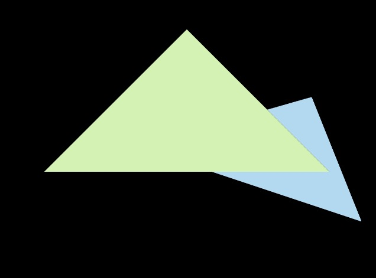
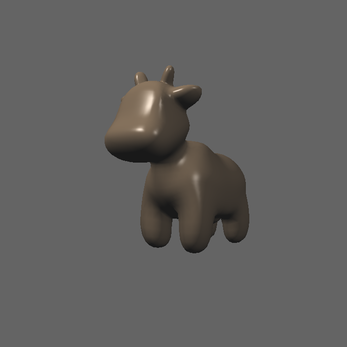
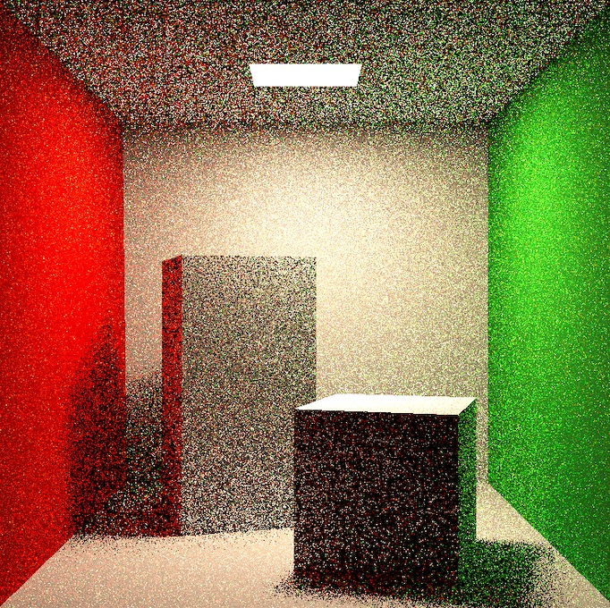

# GAMES101-Assignment

## Assignment1

三角形绕z轴的旋转使用r.set_model(get_rotation(Eigen::Vector3f(0.0,0.0,1.0),angle));实现

程序运行时会显示使用get_rotation绕z轴得到的矩阵，以及直接绕z轴旋转得到的矩阵，两者旋转的数值相同。

## Assignment2

- [x] [5 分] 正确地提交所有必须的文件，且代码能够编译运行。
- [x] [20 分] 正确实现三角形栅格化算法。
- [x] [10 分] 正确测试点是否在三角形内。
- [x] [10 分] 正确实现 z-buffer 算法, 将三角形按顺序画在屏幕上。
- [x] [提高项 5 分] 用 super-sampling 处理 Anti-aliasing : 你可能会注意 到，当我们放大图像时，图像边缘会有锯齿感。我们可以用 super-sampling 来解决这个问题，即对每个像素进行 2 * 2 采样，并比较前后的结果 (这里 并不需要考虑像素与像素间的样本复用)。需要注意的点有，对于像素内的每 一个样本都需要维护它自己的深度值，即每一个像素都需要维护一个 sample list。最后，如果你实现正确的话，你得到的三角形不应该有不正常的黑边。

实现评分所要求的内容，并且实现了MSAA的的反走样

**实现结果**



**未抗锯齿**

**MSAA**

## Assignment3

- [x] [5 分] 提交格式正确，包括所有需要的文件。代码可以正常编译、执行。
- [x] [10 分] 参数插值: 正确插值颜色、法向量、纹理坐标、位置 (Shading Position) 并将它们传递给 fragment_shader_payload.
- [x] [20 分]Blinn-phong 反射模型: 正确实现 phong_fragment_shader 对应的 反射模型。
- [x] [5 分] Texture mapping: 将 phong_fragment_shader 的代码拷贝到 texture_fragment_shader, 在此基础上正确实现 Texture Mapping.
- [x] [10 分] Bump mapping 与 Displacement mapping: 正确实现 Bump mapping 与 Displacement mapping.
- [x] [Bonus 3 分] 尝试更多模型: 找到其他可用的.obj 文件，提交渲染结果并 把模型保存在 /models 目录下。这些模型也应该包含 Vertex Normal 信息。
- [x] [Bonus 5 分] 双线性纹理插值: 使用双线性插值进行纹理采样, 在 Texture 类中实现一个新方法 Vector3f getColorBilinear(float u, float v) 并 通过 fragment shader 调用它。为了使双线性插值的效果更加明显，你应该 考虑选择更小的纹理图。请同时提交纹理插值与双线性纹理插值的结果，并 进行比较。

### Blinn-phong


### Texture mapping


### Bump mapping

### Displacement mapping


### 尝试更多模型

直接选用model下的rock模型


### 双线性纹理插值: 

先将纹理贴图分辨率降低，更容易看出区别

高分辨率未插值：

低分辨率未插值：

低分辨率插值


可以看到在颜色突变的位置有明显优化效果

## Assignment4

- [x] [5 分] 提交的格式正确，包含所有必须的文件。代码可以编译和运行。
- [x] [20 分] De Casteljau 算法： 对于给定的控制点，你的代码能够产生正确的 Bézier 曲线。
- [x] [5 分] 奖励分数： 实现对 Bézier 曲线的反走样。(对于一个曲线上的点，不只把它对应于一个像素，你需要根据到像素中心的距离来考虑与它相邻的像素的颜色。)

**反走样效果图**


## Assignment5

- [x] [5 分] 提交的格式正确，包含所有必须的文件。代码可以编译和运行。
- [x] [10 分] 光线生成： 正确实现光线生成部分，并且能够看到图像中的两个球体。
- [x] [15 分] 光线与三角形相交： 正确实现了 Moller-Trumbore 算法，并且能够看到图像中的地面。

### 结果图：


## Assignment6

- [x] [5 points] 提交格式正确，包含所有需要的文件；
- [x] [20 points] 包围盒求交：正确实现光线与包围盒求交函数
- [x] [15 points] BVH 查找：正确实现 BVH 加速的光线与场景求交。
- [x] [加分项 20 points] SAH 查找：自学 SAH(Surface Area Heuristic) , 正 确实现 SAH 加速，并且提交结果图片，并在 README.md 中说明 SVH 的实现 方法，并对比 BVH、SVH 的时间开销。(可参考 http://15462.courses.cs .cmu.edu/fall2015/lecture/acceleration/slide_024，也可以查找其他资 料)

### 结果图片 

### SAH实现

简而言之就是将空间先分为n个桶，然后做一条切线将n个桶分成两组，这两组各有一个所含物体的面积，根据面积可以得到下图公式的值


最后求出使Cost（C）最小的分组方式。

### 实现参考

http://15462.courses.cs.cmu.edu/fall2015/lecture/acceleration/slide_038

https://www.cnblogs.com/coolwx/p/14375763.html

https://www.cnblogs.com/lookof/p/3546320.html

### 实现代码：

```c++
BVHBuildNode* BVHAccel::SAHrecursiveBuild(std::vector<Object*> objects)
{
    BVHBuildNode* node = new BVHBuildNode();

    // Compute bounds of all primitives in BVH node
    Bounds3 bounds;
    for (int i = 0; i < objects.size(); ++i)
        bounds = Union(bounds, objects[i]->getBounds());
    if (objects.size() == 1) {
        // Create leaf _BVHBuildNode_
        node->bounds = objects[0]->getBounds();
        node->object = objects[0];
        node->left = nullptr;
        node->right = nullptr;
        return node;
    }
    else if (objects.size() == 2) {
        node->left = recursiveBuild(std::vector{objects[0]});
        node->right = recursiveBuild(std::vector{objects[1]});

        node->bounds = Union(node->left->bounds, node->right->bounds);
        return node;
    }
    else {
        const int bucketSize = 12;
        Bounds3 centroidBounds;
        for (int i = 0; i < objects.size(); ++i)
            centroidBounds =
                    Union(centroidBounds, objects[i]->getBounds().Centroid());
        int dim = centroidBounds.maxExtent();

        std::vector<Object*> leftObjects;
        std::vector<Object*> rightObjects;

        float nArea = centroidBounds.SurfaceArea();

        int minCostCoor = 0;
        int minCostIndex = 0;
        float minCost = std::numeric_limits<float>::infinity();
        std::map<int, std::map<int,int>> indexMap;// TODO

        for(int i=0;i<3;i++)
        {
            std::vector<Bounds3> boundsBuckets;
            std::vector<int> countBuckets;
            for(int j=0;j<bucketSize;j++)
            {
                boundsBuckets.push_back(Bounds3());
                countBuckets.push_back(0);
            }

            std::map<int,int> objMap;

            for(int j =0;j<objects.size();j++)//把一个新的三角形放进去
            {
                //这里在mac下会有一点编译的小问题
                float p[3];
                p[0]=(centroidBounds.Offset(objects[j]->getBounds().Centroid())).x;
                p[1]=(centroidBounds.Offset(objects[j]->getBounds().Centroid())).y;
                p[2]=(centroidBounds.Offset(objects[j]->getBounds().Centroid())).z;

                int index = bucketSize * p[i];//返回物体所在桶对位置

                if(index > bucketSize-1)
                {
                    index = bucketSize-1;
                }
                Bounds3 b =boundsBuckets[index];
                b = Union(b,objects[j]->getBounds().Centroid());
                boundsBuckets[index] = b;
                countBuckets[index] = countBuckets[index]+1;
                objMap.insert(std::make_pair(j,index));
            }

            indexMap.insert(std::make_pair(i,objMap));

            for(int j=0;j<boundsBuckets.size();j++)
            {
                Bounds3 A;
                Bounds3 B;

                int countA = 0;
                int countB = 0;

                for(int k=0;k<j;k++)
                {
                    A = Union(A,boundsBuckets[k]);
                    countA += countBuckets[k];
                }
                for(int k=j;k<boundsBuckets.size();k++)
                {
                    B = Union(B,boundsBuckets[k]);
                    countB +=countBuckets[k];
                }
                float cost = 1 + (countA*A.SurfaceArea()+countB*B.SurfaceArea())/nArea;

                if(cost < minCost)
                {
                    minCost = cost;
                    minCostCoor = i;
                    minCostIndex = j;
                }
            }
        }

        for(int i = 0; i<objects.size();i++)//object的index和桶的index进行了绑定
        {
            if(indexMap[minCostCoor][i]<minCostIndex)
                leftObjects.push_back(objects[i]);
            else
                rightObjects.push_back(objects[i]);
        }

        assert(objects.size() == (leftObjects.size() + rightObjects.size()));

        node->left = recursiveBuild(leftObjects);
        node->right = recursiveBuild(rightObjects);

        node->bounds = Union(node->left->bounds, node->right->bounds);

    }

    return node;
}
```

## Assignment7

- [x] [5 points] 提交格式正确，包含所有需要的文件；代码可以在虚拟机下正确编译运行。

- [x] [45 points] Path Tracing：正确实现 Path Tracing 算法，并提交分辨率 不小于 512*512，采样数不小于 8 的渲染结果图片。

- [x] [加分项 10 points] 多线程：将多线程应用在 Ray Generation 上，注意实现时可能涉及的冲突。

- [ ] [加分项 10 points] Microfacet：正确实现 Microfacet 材质，并提交可 体现 Microfacet 性质的渲染结果。

  使用简单的openmp进行多线程的实现

  


spp=1:

spp=16:


## Assignment8

- [x] [5 分] 提交的格式正确，包含所有必须的文件。代码可以编译和运行。
- [x] [5 分] 连接绳子约束，正确的构造绳子
- [x] [5 分] 半隐式欧拉法
- [x] [5 分] 显式欧拉法
- [x] [10 分] 显式 Verlet
- [x] [5 分] 阻尼

结果图片:


## FinalProject

### 选择题目2.3.2，基于 3D 位置的流体模拟 (难度等级：2.5)

本次作业实现了基于 3D 位置的流体模拟，使用taichi语言进行粒子模拟，然后使用[Fluid-engine-dev](https://github.com/doyubkim/fluid-engine-dev)中的小工具particles2obj进行流体的表面重建，最后使用blender进行渲染

投影到taichi  2d gui上的画面：


blender渲染结果图：


### References

https://github.com/ben441318936/PBF3D_taichi

Position Based Fluids

Position Based Dynamics

Particle-Based Fluid Simulation for Interactive Applications
